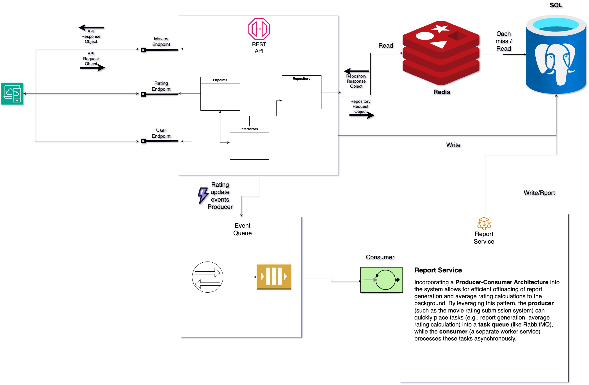

# Backend Senior Coding Challenge 🍿

In the following sections, I will outline the implementation of the movie rating system, 
highlighting how the various requirements have been fulfilled. 
This includes a detailed breakdown of the system's design, architecture, 
technology stack, and future outlook. 

The documentation is structured as follows:

- [✅ Requirements](#-requirements)
- [🛠️ System Design](#-system-design)
- [🗂️ System Structure](#-system-structure)
- [🛠️ Implementation Stack](#-implementation-stack)
- [⚙️ Setup](#-setup)
- [📝 To-Do List](#-to-do-list)

## ✅ Requirements

- [ ] The backend should expose RESTful endpoints to handle user input and
  return movie ratings.
- [ ] The system should store data in a database. You can use any existing
  dataset or API to populate the initial database.
- [ ] Implement user endpoints to create and view user information.
- [ ] Implement movie endpoints to create and view movie information.
- [ ] Implement a rating system to rate the entertainment value of a movie.
- [ ] Implement a basic profile where users can view their rated movies.
- [ ] Include unit tests to ensure the reliability of your code.
- [ ] Ensure proper error handling and validation of user inputs.
- [ ] Implement authentication and authorization mechanisms for users.
- [ ] Provide documentation for your API endpoints using tools like Swagger.
- [ ] Implement logging to record errors and debug information.
- [ ] Implement caching mechanisms to improve the rating system's performance.
- [ ] Implement CI/CD quality gates.

## 🛠️ System Design

This system exposes a RESTful API to handle user actions like creating users, adding movies, submitting/viewing ratings, and managing user profiles. The backend architecture ensures performance, scalability, and maintainability by separating concerns and incorporating caching, persistence, and business logic layers.

The system adopts a **data-driven design approach** to ensure maintainability, clarity, and separation of concerns across all layers.

### 📦 Data Flow with Distinct Models

The architecture distinguishes between various data representations at different layers of the application:

- **API Request/Response Objects**:
  - Defined specifically for external clients (e.g., frontend apps).
  - Handle validation, formatting, and documentation.
  - Decoupled from internal logic to keep the API layer clean and modular.

- **Domain Models**:
  - Used internally by the **Interactor layer** to encapsulate business logic.
  - Contain business rules, validations, and behavior.
  - Abstract away how the data is stored or presented externally.

- **Repository Request/Response Objects**:
  - Used to interact with the **data access layer (repository)**.
  - Handle persistence-specific formatting for PostgreSQL and Redis.
  - Allow seamless switching between cache and database access or different db engines in the future.

### ✅ Benefits of This Approach

- **Separation of Concerns**:
  - Each layer (API, Logic, Persistence) operates on its own data model, minimizing cross-layer coupling.

- **Flexibility & Testability**:
  - Easier to unit test each layer in isolation using mock data structures.

- **Robustness**:
  - Clear type and schema boundaries reduce the risk of data-related bugs.

- **Scalability**:
  - Adapting to future requirements (e.g., GraphQL, gRPC, or NoSQL) becomes easier with clean abstractions.


## 🗂️ System Structure
### 🔷 Frontend Client
- Sends HTTP API requests and receives JSON responses.
- Communicates with the backend through well-defined REST endpoints.

### 🔷 REST API Layer
- Exposes the following endpoints:
  - **Movies Endpoint**: Create and view movie information.
  - **Rating Endpoint**: Submit and retrieve movie ratings.
  - **User Endpoint**: Create and view user information and profiles.
- Parses API Request Objects and sends responses.
- Handles request validation and basic error responses.

### 🔷 Interactors (Business Logic Layer)
- Implements core business logic.
- Validates inputs, checks permissions, and coordinates repository access.
- Ensures consistent rules (e.g., unique rating per user per movie).

### 🔷 Repository Layer
- Interfaces with both **Redis** and **PostgreSQL**.
- Workflow:
  1. **Read from Redis** (cache).
  2. If cache miss, **read from PostgreSQL**.
  3. **Write results to Redis** for future access.
- Uses Repository Request/Response objects for abstraction.

### 🔷 Redis (Cache)
- Stores frequently accessed data (e.g., top-rated movies).
- Reduces read pressure on PostgreSQL.
- Ensures faster response times.
- The caching is done in this system by ensuring the record must first be fetched from cache and if it is not exists, then direct query to the db to fetch it. Also, when add new rating entry the cache will be invalidated.

### 🔷 PostgreSQL (Primary Database)
- Stores user, movie, and rating data persistently.
- Supports complex joins and transactions.

## 🛠️ Implementation Stack
Some of the major libraries and dev stack used in this project can be summarised into:

## 🛠️ Implementation Stack

- **FastAPI**:
  - Lightweight and high-performance web framework for building RESTful APIs.
  - Automatic data validation, interactive Swagger docs, and async support.

- **Python**:
  - Core programming language used to implement the backend logic, interactors, and endpoint handling.

- **SQLAlchemy**:
  - ORM (Object Relational Mapper) for Python.
  - Handles database models, queries, and relationships with PostgreSQL.

- **PostgreSQL**:
  - Relational database used for persistent storage of users, movies, and ratings.
  - Supports complex queries, indexing, and transactional integrity.

- **Redis**:
  - In-memory data store used for caching frequently accessed data (e.g., movie ratings).
  - Improves response time and reduces load on PostgreSQL.

- **JWT (JSON Web Tokens)**:
  - Used for stateless user authentication.
  - Includes token generation, validation, and expiration management for secure user sessions.

- **Pydantic**:
  - Used for data validation and serialization/deserialization of API request/response models.

- **Uvicorn**:
  - ASGI server to run the FastAPI application efficiently with support for asynchronous requests.

- **Pytest**:
  - Testing framework used to write unit and integration tests for endpoints and logic layers.

## ⚙️ Setup
This section describes how to get your Movie Rating System up and running using either Docker (recommended for ease) or a manual approach for advanced control and debugging.

### 🐳 Option 1: Easy Setup with Docker (Recommended)

You can run all required services — including the FastAPI server, PostgreSQL database, and Redis cache — using Docker Compose.

#### ✅ Steps:
1. Ensure [Docker](https://www.docker.com/get-started) and [Docker Compose](https://docs.docker.com/compose/) are installed.
2. Clone the repository and navigate to the project root directory.
3. Run the following command:
```bash
docker compose -f ./docker-compose.local.yml up --build
```
This will:
- Start the FastAPI application. 
- Spin up PostgreSQL with the default database movie. 
- Start Redis for caching.

🧪 Test Environment:
- A separate test database called `test-movie` is used during automated testing. 
- The application startup script will attempt to create both `movie` and `test-movie` databases automatically. 
- If creation fails due to permission issues, manually create them in your `PostgreSQL` instance and ensure the connection strings in the `backend/.env` file are updated accordingly.

### 🔧 Option 2: Manual Setup (Advanced)
Use this method if you prefer running services locally or in a specific environment (e.g., virtual machines, cloud setups).

#### ✅ Prerequisites:
- Python 3.10+ 
- poetry
- PostgreSQL 
- Redis 

#### 🛠️ Steps:
1. Install dependencies:
```bash 
cd backend
poetry env activate
poetry install
```
2. Start PostgreSQL and Redis:
- Start your PostgreSQL service and ensure a database named `movie` exists. 
- Start Redis (default port 6379).
3. Ensure the database url and redis url are correctly set in `backend/.env`
4. Run the FastAPI app (ensure you are in backend directory):
```bash 
python server.py 
```
## 📝 To-Do List


1. Incorporating a **Producer-Consumer Architecture** into the system allows for efficient offloading of report generation and average rating calculations to the background. 
   - By leveraging this pattern, the **producer** (such as the movie rating submission system) can quickly place tasks (e.g., report generation, average rating calculation) into a **task queue** (like RabbitMQ), while the **consumer** (a separate worker service) processes these tasks asynchronously. 
   - This design allows the system to continue handling incoming requests without being blocked by the time-consuming calculations or report generation. As a result, it enhances the **availability** of the system by ensuring that the user-facing components are not delayed by background operations. 
   - Additionally, by **updating the database** in the background, the system can maintain real-time data while still offloading intensive operations to dedicated workers, improving overall **scalability** and **performance**.

2. While you are already utilizing **FastAPI** and **Pydantic** for schema validation, further enhancements can be made by incorporating more granular validation schemas. 
   
3. To follow the principles of **Clean Architecture** more closely, consider moving the logic from your endpoint handlers into a **Presenter Layer**. 
   
4. While your current system is API-based, I considered extending it by creating a **mini UI application** that interacts with your API. so the project structure has `backend` and `frontend` subfolders 
   
5. For **consistent testing**, it's important to have a separate **test environment** where the Redis service runs on a different port and doesn’t interfere with the production system. 

